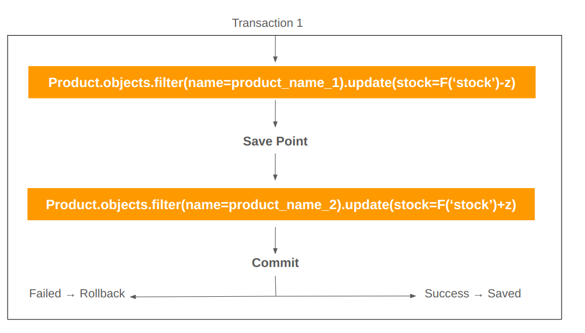

# Održavanje konzistentnosti u bazi

## Identifikovanje problema

Obzirom da moramo da pazimo na konzistentnost podataka zbog velikog broja korisnika, krećemo sa pronalaženjem potencijalnih problema u našoj aplikaciji.Očevidno je da problemi nastaju pretežno u pisanju ili update-ovanju podataka.

Potencijalne probleme iz tog razloga mogu da nam prave sledeći end-pointi:

Kreiranje korisnika, Odgovaranje na primedbe, Update-ovanje kriterijuma za popuste i slično. Za ovakve operacije opredeljujemo se da koristimo `transaction.atomic`.

## `transaction.atomic` u DRF



`transaction.atomic` u Django REST Framework-u je alat koji se koristi za upravljanje transakcijama na nivou baze podataka. Ova funkcionalnost je deo Django ORM-a (Object-Relational Mapping) i koristi se da bi se osiguralo da se određeni skup operacija nad bazom podataka izvršava kao jedna transakcija. Ako se dogodi greška tokom izvršavanja bilo koje operacije unutar tog skupa, sve promene se poništavaju, čime se vraća baza podataka u prethodno stanje.

### Osnove Transakcija u Bazama Podataka

Transakcije su ključni koncept u upravljanju bazama podataka. U kontekstu baza podataka, transakcija je skup operacija koje se izvršavaju kao jedna celina. Za transakciju važe četiri osnovna svojstva, poznata kao ACID svojstva:

1. **Atomicity (Atomarnost)**: Transakcija je "sve ili ništa". Ako neka operacija unutar transakcije ne uspe, sve operacije u okviru te transakcije se poništavaju.
2. **Consistency (Konzistentnost)**: Transakcija mora da ostavi bazu podataka u konzistentnom stanju. Ako je baza bila u konzistentnom stanju pre transakcije, ona mora biti u konzistentnom stanju i nakon nje.
3. **Isolation (Izolacija)**: Transakcije moraju biti izolovane jedna od druge, što znači da transakcija koja je u toku ne sme da vidi međurezultate drugih transakcija.
4. **Durability (Trajnost)**: Kada je transakcija uspešno završena, sve promene u bazi moraju biti trajne, čak i u slučaju pada sistema.

### Kako `transaction.atomic` Radi u Django-u

`transaction.atomic` je kontekst menadžer (koristi se sa `with` naredbom) koji omogućava atomarne operacije u Django aplikacijama. Kada se koristi `transaction.atomic`, sve operacije nad bazom podataka koje se izvrše unutar tog bloka biće tretirane kao jedna transakcija.

Evo kako se koristi `transaction.atomic`:

```python
from django.db import transaction

def my_view(request):
    with transaction.atomic():
        # ovde idu sve operacije koje se trebaju izvršiti atomarno
        model_instance1.save()
        model_instance2.save()
        # Ako se dogodi bilo kakva greška unutar ovog bloka,
        # sve promene će biti poništene.

```

Ako se dogodi neka greška (na primer, izuzetak), Django će automatski pozvati `ROLLBACK` i poništiti sve promene napravljene unutar tog bloka transakcije. Ako se sve operacije unutar `transaction.atomic` uspešno izvrše, tada će se izvršiti `COMMIT` i sve promene će biti trajno upisane u bazu.

### Nivoi Izolacije

Baze podataka obezbeđuju različite nivoe izolacije kako bi se nosile sa problemima konkurentnosti. Django koristi `transaction.atomic` u kombinaciji sa podrazumevanim nivoom izolacije baze podataka (obično je to **Read Committed** u većini baza podataka kao što su PostgreSQL, MySQL, itd.). Različiti nivoi izolacije uključuju:

1. **Read Uncommitted**: Najniži nivo izolacije, gde su sve vrste konkurentnih problema dozvoljene.
2. **Read Committed**: Ne dozvoljava `dirty read`, ali `non-repeatable read` i `phantom read` su mogući.
3. **Repeatable Read**: Ne dozvoljava `dirty read` i `non-repeatable read`, ali `phantom read` je moguć.
4. **Serializable**: Najviši nivo izolacije, gde nijedan od pomenutih problema nije moguć, ali uz potencijalno smanjenje performansi.

### Zaključak

`transaction.atomic` u Django REST Framework-u pruža jednostavan način za upravljanje transakcijama i osigurava da se skup operacija nad bazom podataka izvrši atomarno. U kombinaciji sa pravim nivoom izolacije baze podataka, može pomoći u održavanju integriteta podataka i rešenju problema konkurentnosti u aplikacijama sa više korisnika. Korisno je razumeti kako funkcionišu transakcije i konkurentnost da bi se efikasno koristio ovaj alat u razvoju aplikacija zasnovanih na Django-u.